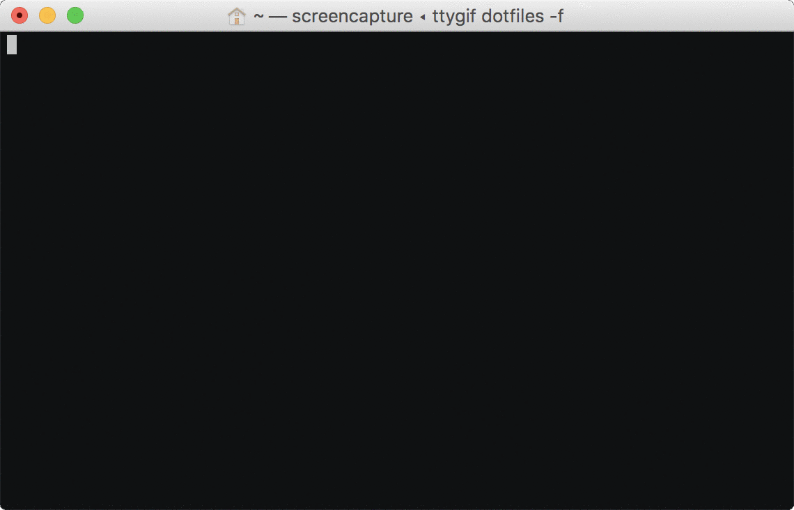

# Dotfiles

This is how I roll (on a Mac).



**Warning:** If you want to give these dotfiles a try, review and modify the settings before running this.

This Git repository is not meant to be usable as is. Mix and match with your own taste and existing configuration. It would be very surprising if anyone had the same applications purchased from App store.

In fact, I'm not using a git repository to share dotfiles between machines. The dotfiles are stored on a network drive (Dropbox, iCloud Drive, etc.) that is mounted on my computers. Any changes will be automatically synchronised as the dotfiles are symlinked to home directory.

### Installation

Prerequisites:

1. Log in to Mac App Store
2. Set up a private SSH key

Then run the set up script

```
rake
```

### Missing values

Configuration files containing personal information are redacted:

* Atom base configuration with Gist id and access token
* NPM/Rubygems credentials
* private SSH host-specific configuration
* name/email from Git config

I have a git configuration script to redact personal information. This is configured in the local `.git/config`. For example redact full name in gitconfig:

```
[filter "gitconfig"]
	clean = sed -e 's/email@example.com/REDACTED_EMAIL/g' | sed -e 's/Full Name/REDACTED_NAME/g'
	smudge = sed -e 's/REDACTED_EMAIL/email@example.com/g' | sed -e 's/REDACTED_NAME/Full Name/g'
```

This is run as there is a definition in `.gitattributes`:

```
gitconfig filter=gitconfig
```
